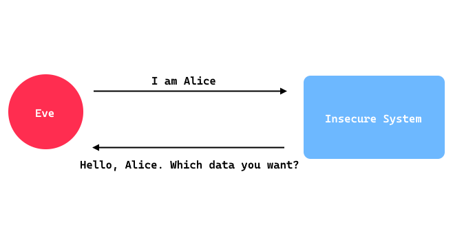

# AC-AUTHN - Improper Authentication (C)

### Related CWE(s): CWE-287 (Uyum Oranı: 9/9 (%100))
### Related CVE(s): ARAŞTIRILMADI

When an identity is claimed by an actor, the system does not confirm the authenticity of that claim, or the confirmation process is inadequate. Here is very (very, very) simple diagram how it works:



There are several vulnerabilities that could lead to this. For instance, a password might be stored in plaintext within the code, allowing an attacker to obtain it and later access the system without multi-factor authentication (MFA). Another possibility is that the system is susceptible to user enumeration, enabling an attacker to discover valid usernames and then continue the attack with a specific account. Below is an example of a user enumeration vulnerability in code (Java - Spring Boot):

```
...
@PostMapping("/login")
public ResponseEntity<LoginResponse> login(@RequestBody LoginRequestDto loginRequestDto) {
    Optional<User> userOpt = users.findByUsername(loginRequestDto.getUsername());

    if (userOpt.isEmpty()) {
        return ResponseEntity.status(HttpStatus.NOT_FOUND)
                .body(new LoginResponse(false, "User does not exist"));
    }

    User user = userOpt.get();

    if (!BCrypt.checkpw(loginRequestDto.getPassword(), user.getPasswordHash())) {
        return ResponseEntity.status(HttpStatus.UNAUTHORIZED)
                .body(new LoginResponse(false, "Password is incorrect"));
    }

    return ResponseEntity.ok(new LoginResponse(true, "Welcome " + user.getUsername()));
}
...
```

In this code, because of "User does not exist" return, attacker can enumerate users. You can find more weaknesses like this under this category.

