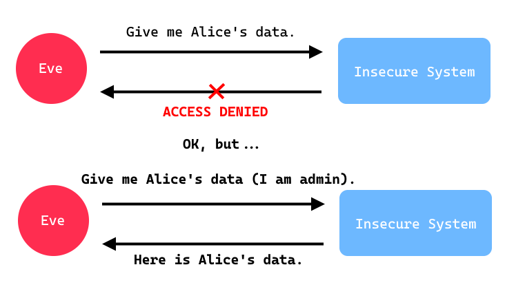

# AC-AUTHZ - Improper Authorization (C)

### Related CWE(s): CWE-285 (Uyum Oranı: 7/10 (%70)), CWE-863 (Uyum Oranı: 5/6 (%83))
### Related CVE(s): ARAŞTIRILMADI

A system may have correctly implemented authentication and successfully verified a user’s identity, but the next step is authorization. Even authenticated users should not be able to access certain objects or perform certain actions. Due to improper implementations, a user may sometimes gain access to objects they should not see or carry out actions they are not authorized to perform. We have grouped the weaknesses that can lead to such situations under this category.

