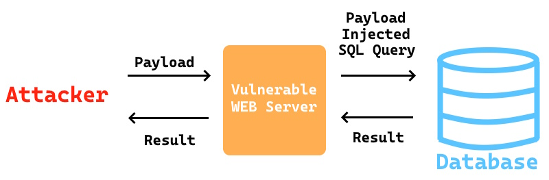

# INJ-QUERY-SQL - SQL Injection (W)

### Related CWE(s): CWE-89
### Related CVE(s): ARAŞTIRILMADI

SQL Injection is a common attack technique targeting web applications. In the OWASP Top 10 2025, it is listed under item [A05: Injection](https://owasp.org/Top10/2025/A05_2025-Injection/) and in the CWE classification it is identified as "CWE-89: Improper Neutralization of Special Elements used in an SQL Command ('SQL Injection')." It occurs when user input is used directly as part of an SQL query without proper validation or sanitization. As a result, it allows an attacker to execute arbitrary commands on the database.



Web applications consist of two components: frontend and backend. The input provided by the user interacting through the frontend is sent to the backend, where operations are performed on the database. Below, you can see an example workflow. In this scenario, the user is able to search for other users in the application (assuming that deleted users are soft deleted and still stored in the database).

```
// src/SearchUserForm.jsx
import React, { useState } from "react";

function SearchUserForm() {
  const [username, setUsername] = useState("");
  const [results, setResults] = useState([]);

  const handleSubmit = async (e) => {
    e.preventDefault();

    const response = await fetch(
      `http://localhost:8080/api/users/search?username=${encodeURIComponent(username)}`
    );
    const data = await response.json();
    setResults(data);
  };

  return (
    <div style={{ padding: 20 }}>
      <h2>Search Users</h2>
      <form onSubmit={handleSubmit}>
        <div>
          <label>
            Username:
            <input
              type="text"
              value={username}
              onChange={(e) => setUsername(e.target.value)}
            />
          </label>
        </div>
        <button type="submit">Search</button>
      </form>

      <h3>Results</h3>
      <ul>
        {results.map((user) => (
          <li key={user.id}>
            {user.id} - {user.username} ({user.email})
          </li>
        ))}
      </ul>
    </div>
  );
}

export default SearchUserForm;
```

User input is sent to the backend. Let's assume that following code snippet is executed on the backend side.

```
...
public List<User> findByUsername(String username) {

    List<User> result = new ArrayList<>();
    String sql = "SELECT id, username, email FROM users WHERE username = '" + username + "' AND isDeleted = 0";

    try (Connection conn = DriverManager.getConnection(URL, USER, PASS);
            Statement stmt = conn.createStatement();
            ResultSet rs = stmt.executeQuery(sql)) {

        while (rs.next()) {
            User u = new User(
                    rs.getLong("id"),
                    rs.getString("username"),
                    rs.getString("email")
            );
            result.add(u);
        }

    } catch (SQLException e) {
        e.printStackTrace();
    }

    return result;
}
...
```

As can be seen, the input received from the user is directly embedded into the SQL query without any validation ("SELECT id, username, email FROM users WHERE username = '" + username + "' AND isDeleted = 0"). If the user enters a value such as "' OR 1=1; --" in the username field, it will return all users. This should not be underestimated as "a service that already fetches users" because the attacker can also obtain information of users who have deleted their accounts (assuming they are soft deleted). Even worse, if the input is "'; DROP TABLE users; --", the entire users table could be removed. In other words, it leads to arbitrary command execution. SQL Injection can expose sensitive data and therefore result in unauthorized access and data loss.

Before diving into the subcategories, if we look at what can be done for remediation: we should not embed the input received from the user directly into the query without validation. We should either apply a whitelist (blacklists are never fully reliable) or use parameterized queries. Parameterized queries treat user input as a parameter rather than a part of the query, preventing injection. Additionally, we should avoid displaying error messages directly to the user. Below, you can see a code snippet that is resilient against SQL Injection.

```
...
String sql = "SELECT id, username, email FROM users WHERE username = ? AND isDeleted = 0";

try (Connection conn = DriverManager.getConnection(URL, USER, PASS);
        PreparedStatement pstmt = conn.prepareStatement(sql)) {
    pstmt.setString(1, username);
...
```

The commonly recognized categories of SQL Injection in the literature are as follows:
- Classic (in-band) SQL Injection
- Error-Based SQL Injection
- Union-Based SQL Injection
- Blind SQL Injection
- Out-of-Band SQL njection
- Second-Order SQL Injection

### Classic (in-band) SQL Injection

Classic, or in-band SQL Injection, is the most common type of SQL injection in which the attacker both injects malicious SQL code and receives the results through the same channel. This type of attack is the simplest and fastest to execute. The attacker inserts SQL statements into the application's input fields, and the results are displayed directly. The first example we provided is a case of classic SQL Injection.

### Error-Based SQL Injection

Error-Based SQL Injection is a technique exploited when the application exposes database error messages to the user. The attacker manipulates the structure of the query to inject data into the resulting error message generated by the database. Through this method, normally unseen information -such as table names, column names, usernames, version details, and even password hashes- can be retrieved through error outputs.

Consider a login page vulnerable to SQL Injection. If a value such as "' OR 1=1 in (SELECT password FROM users WHERE username = 'administrator'); --" is entered in the username field and database errors are displayed directly to the user, the response would include the password hash of the administrator account. This happens because the query segment that triggers the error is crafted to retrieve the administrator's password. The database fails to evaluate the value, throws an error, and in the process exposes the data namely the administrator password hash within the message.

### Union-Based SQL Injection

Union-Based SQL injection is an attack technique that enables the results of an additional SELECT query to be returned within the same response by appending a UNION command to the existing query. If the application displays query results to the user, the attacker can use this method to retrieve data from different tables and columns, directly accessing sensitive information and turning the system into a data extraction mechanism. For the attack to be successful, the number of columns and data types in the injected query must match those of the original query. The attacker can determine the number of columns by performing tests scuh as the following:

```
' ORDER BY 1--
' ORDER BY 2--
' ORDER BY 3--
...
```

Let's assusme that there is 4 columns. Attacker can try following query to learn which columns are useful.

```
' UNION SELECT '1','2','3','4'--
```

Then, He/she edits the UNION query with respect to data which he/she wants and gets sensitive data.

### Blind SQL Injection

Blind SQL injection occurs when an application is vulnerable to SQL injection but its responses do not include the results of the executed SQL query or any database error details. In this case, the attacker must infer information based on the application's behavior or response time. It has two types: Boolean-Based Blind SQL Injection and Time-Based Blind SQL Injection. Although more difficult compared to other types, it still poses a significant risk because tools designed for this purpose (like sqlmap) can automate the exploitation.

### Out-of-Band SQL Injection

Out-of-Band SQL injection, unlike in-band or blind SQL injection techniques, exfiltrates data through an alternative communication channel rather than returning it in the same response. This typically relies on the database's ability to initiate outbound requests, such as DNS or HTTP. The attacker leverages existing connection or file access functions within the database to trigger requests to an external server, embedding sensitive information within those requests. In short, the injection is performed through the application, but the results reach the attacker via a separate outbound connection established by the database.

### Second-Order SQL Injection

In Second-Order SQL Injection, the goal is to store a malicious query within the database to be executed at a later stage. It is triggered when the data submitted by the attacker is later processed and executed as a query by another part of the application. Therefore, the attacker does not receive the result in real time.