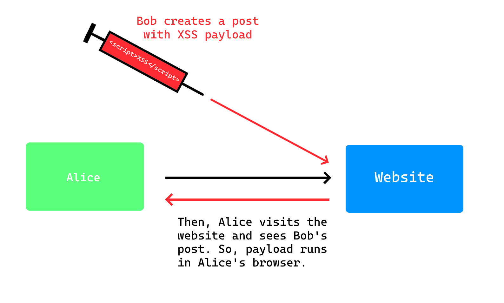

# INJ-WEB-XSS - Cross-Site Scripting (W)

### Related CWE(s): CWE-79
### Related CVE(s): ARAŞTIRILMADI

Cross-Site Scripting (XSS) is a security vulnerability that allows an attacker to inject malicious client-side scripts into a trusted web application. When a user visits the affected application, the user's browser executes these scripts as if they were part of the application's legitimate content. As a result of a successful XSS attack, an attacker may perform actions on behalf of the victim user, access sensitive user data, or, if a privileged user is targeted, gain full control over the application's functionality and data.



XSS vulnerabilities typically arise due to insufficient validation of user input or the failure to securely encode output. Such vulnerabilities are triggered when data received from users is directly injected into HTML content, JavaScript contexts, or other client-side structures interpreted by the browser. XSS vulnerabilities are classified into three main types based on how the attack is carried out: Reflected XSS, Stored (Persistent) XSS, and DOM-Based XSS.

### Reflected XSS

Reflected XSS is a type of cross-site scripting vulnerability that occurs when attacker controlled data is sent to an application via an HTTP request and returned to the user in the same response without being securely processed. The vunlerability arises when such inputs are embedded into HTML or JavaScript contexts without proper context aware encoding. Since the payload is not persistently stored on the application side, exploitation depends on the victim user triggering the crafted request. For example, consider the search functionality of a website. If an attacker enters a malicious input into the search box, and this input is sent to the backend, returned in an unsafe manner, and then processed by the browser causing the payload to execute, this can be classified as Reflected XSS.

### Stored XSS

The main difference between Stored XSS and Reflected XSS is that, in Stored XSS, the malicious payload is persisted on the server side, typically in a database, and can later be delivered to users in an unsafe manner multiple times. As a result, the overall risk is higher compared to Reflected XSS. A common example of this scenario can be observed in blog comment sections. An attacker submits a comment containing an XSS payload, the comment is stored in the database, and when a victim later views the blog comments, the payload is executed in the victim's browser.

In addition, there are cases where applications intentionally accept user input containing HTML markup. For example, in a social media application, users may be allowed to format their profile "about me" sections using bold or italic text, or to embed images. In such cases, allowing specific HTML tags such as b, i, or img may be required. When user input is expected to contain HTML, output encoding alone is not sufficient, as it would neutralize the intended formatting. Instead, input sanitization should be applied, where only explicitly allowed tags and attributes are preserved and all potentially dangerous elements are removed. Sanitization is typically implemented using a strict allowlist approach to prevent the introduction of malicious scripts while still permitting safe markup.

### DOM-Based XSS

DOM-Based XSS is a type of Cross-Site Scripting attack that occurs entirely on the client side (in the browser). The backend does not generate or reflect any malicious content; instead, the vulnerability arises from JavaScript code that manipulates the DOM in an unsafe manner. Here is a code snippet which is vulnerable to DOM-Based XSS:

```
<!DOCTYPE html>
<html>
<head>
  <meta charset="UTF-8">
  <title>Search</title>
</head>
<body>
  <div id="result"></div>
  <script>
    const params = new URLSearchParams(window.location.search);
    const q = params.get("q");
    document.getElementById("result").innerHTML =
      "Search result: " + q;
  </script>
</body>
</html>
```

If attacker crafts a URL such as /search?q=%3Cimg%20src%3Dx%20onerror%3Dalert(1)%3E and a victim clicks on it, the malicious payload is interpreted by the victim's browser as part of the page content. As a result, the injected onerror event handler is executed and an alert pop-up is displayed in the victim's browser, demonstrating successful client-side code execution. This occurs because user controlled input is written to the DOM using innerHTML, causing it to be interpreted as HTML. Using textContent, which treats the input as plain text, would prevent the execution of injected markup and thus mitigate the XSS vulnerability.

### Examples in Different Languages

After explaining what XSS is and how it is classified, it can be useful to examine examples of incorrect usage across different programming languages. If the features provided by languages and frameworks are used without sufficient care, XSS vulnerabilities may arise. Below, you can see the JSP version of our previous example.

```
...
  <form method="GET" action="search.jsp">
    <label>Query:</label>
    <input type="text" name="q" />
    <button type="submit">Search</button>
  </form>

  <hr/>

  <%
      String q = request.getParameter("q");

      if (q != null) {
          out.println("<div>Search result for: <b>" + q + "</b></div>");
      }
  %>
...
```

Printing user-supplied input directly to the response using out.println is not a good practice, as it may lead to XSS vulnerabilities. Instead, if the input is safely encoded using OWASP's Encoder, for example with String safeQ = Encode.forHtml(q);, and then written to the output, the XSS vulnerability will be mitigated. 

As an example in .NET MVC, consider rendering a value using <%= Model.SomeProperty %>. This usage may lead to XSS because the <%= syntax can cause the injected payload to be executed. Instead, <%= Html.DisplayFor(x => x.SomeProperty) %> or <%: Model.SomeProperty %> should be used. As can be seen, even a small change in a single character can play a significant role in determining whether an XSS vulnerability occurs.

Finally, let us give an example from React. Incorrect usage of the dangerouslySetInnerHTML property in React can lead to XSS vulnerabilities. As mentioned earlier in this article, there may be cases where certain user-supplied HTML tags need to be allowed. In such scenarios, dangerouslySetInnerHTML can be used; however, extreme caution must be exercised, and the input must be sanitized (not encoded).

As can be seen, XSS manifests itself differently across programming languages and frameworks, and each environment introduces its own specific patterns and pitfalls. Therefore, when aiming to prevent XSS, it is crucial to have a solid understanding of the features and default behaviors provided by the language or framework in use, to consciously decide how user input should be handled and rendered, and to clearly identify where the data originates and in which context it is being used. Taking these factors into account significantly reduces the likelihood of introducing XSS vulnerabilities into an application.

